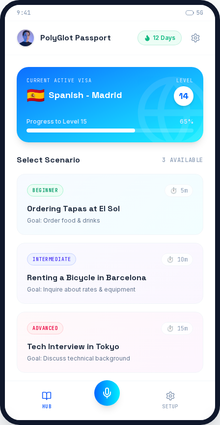
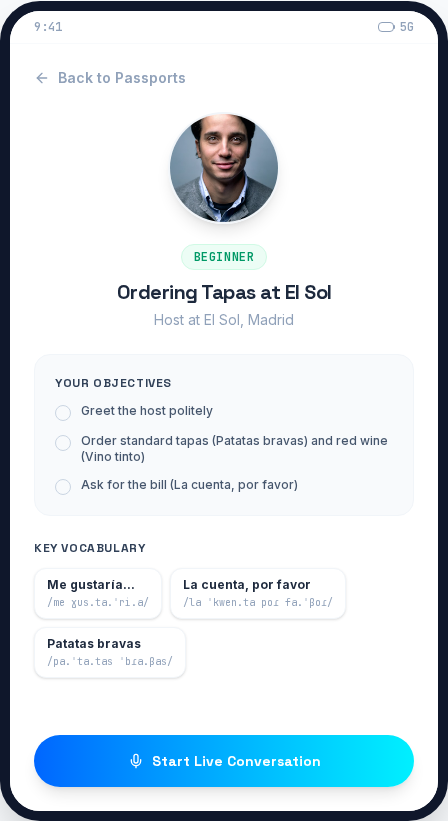
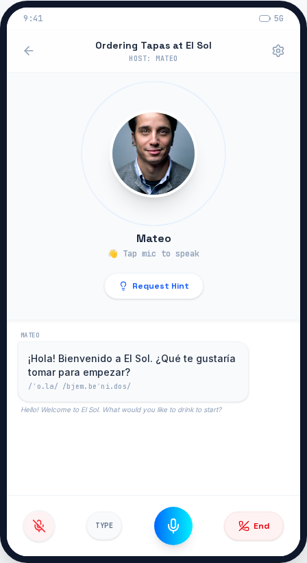
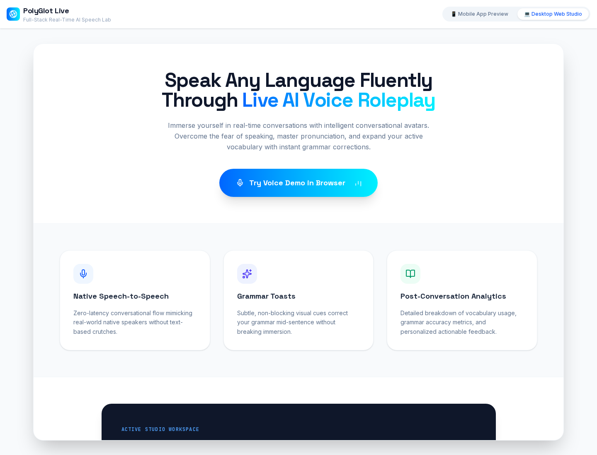

# PolyGlot Live

Spanish speaking lab for learners who want live roleplay, not flashcards. Order tapas in Madrid, rent a bike in Barcelona, or sit a tech interview — then get IPA, grammar toasts, and a fluency scorecard.

[](https://polygot-snowy.vercel.app)
[](https://github.com/devtechedge/polygot/actions/workflows/ci.yml)
[](https://nextjs.org/)
[](https://www.typescriptlang.org/)
[](https://ai.google.dev/)
[](LICENSE)

---

## Live Demo

**https://polygot-snowy.vercel.app**

> **Status:** Portfolio demo. Scenario copy, hosts, and vocab ship in `lib/scenarios.ts`. `POST /api/chat` uses canned host replies unless `GEMINI_API_KEY` is set on the server. Speech uses the browser Web Speech API (Chrome / Edge). Type mode is the fallback. No accounts.

This is the **only** public repo for the project.

---

## Screenshots

| Passport hub | Briefing |
|--------------|----------|
|  |  |

| Live HUD | Desktop studio |
|----------|----------------|
|  |  |

---

## Features

- Three Spanish roleplays: El Sol tapas (beginner), Barcelona bike rental (intermediate), Tokyo tech interview (advanced)
- Live HUD with host avatar, transcript, IPA line, and English gloss
- Grammar toasts on gender / conjugation slips (`un copa` → `una copa` in demo mode)
- Vocab chips, hint sheet, flashcards, and a post-call fluency scorecard
- Madrid vs Latin American dialect + 0.8× / 1.0× / 1.2× speech rate
- Mic or type. Public demo does not require a Gemini key

---

## Tech Stack

| Layer | Technology |
|-------|------------|
| Frontend | Next.js 15 (App Router), React 19, TypeScript, Tailwind 4, Motion |
| Speech | Web Speech API (`SpeechRecognition` + `speechSynthesis`) |
| AI | Optional `@google/genai` (`gemini-2.5-flash`). Canned fallback in `lib/demo-chat.ts` |
| Data | Static scenario catalog — not Prisma, not a database |
| Auth | None |
| Hosting | Vercel |
| CI | GitHub Actions — Vitest, `tsc`, Playwright (runs pending ticket 4688107) |

---

## Quick Start

```bash
git clone https://github.com/devtechedge/polygot.git
cd polygot
npm install
cp .env.example .env.local
npm run dev
```

Open **http://localhost:3000**. Gemini is optional.

```bash
npm test
npm run typecheck
npx playwright install chromium
npm run test:e2e
```

---

## Security

Portfolio demo: unauthenticated chat route, canned replies without a key, browser speech. Details: **[SECURITY.md](SECURITY.md)**.

---

## License

MIT. See [LICENSE](LICENSE).
